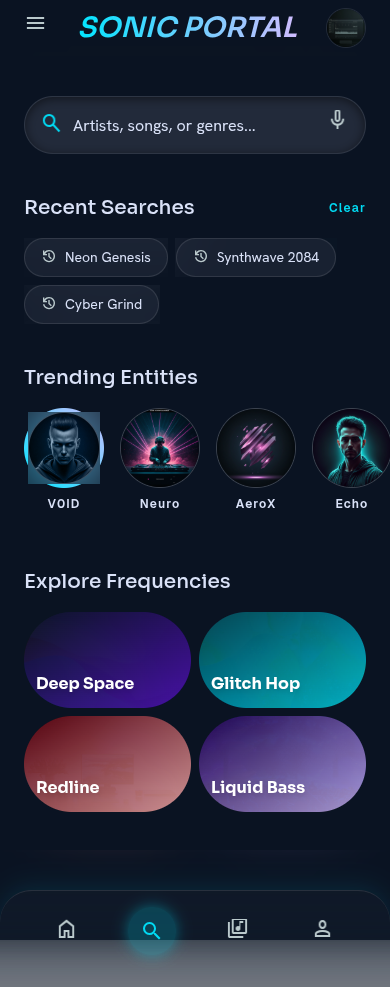
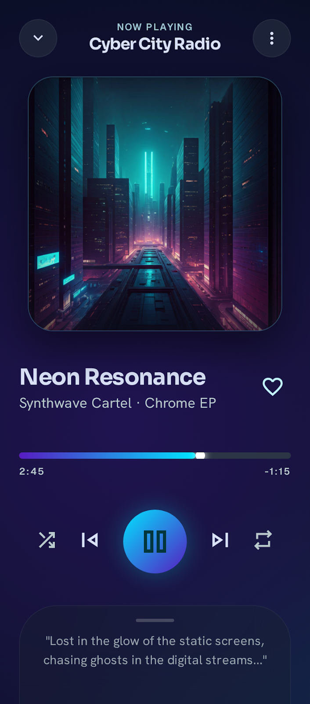
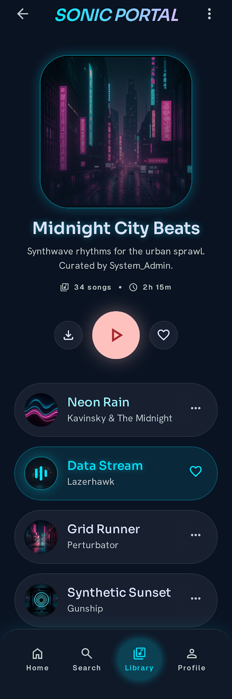
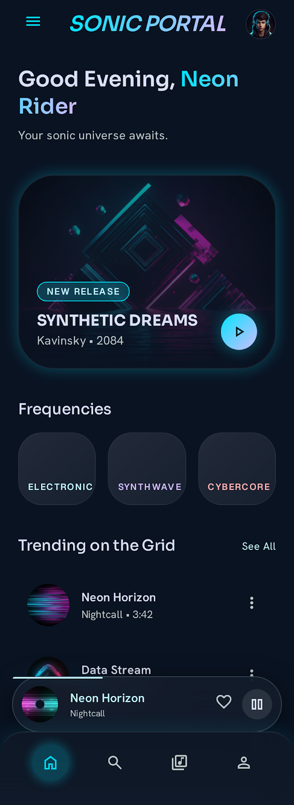

<p align="center">
  
</p>

<p align="center">
  
  
  
  
</p>

<br/>

> **⚠️ Aviso — Projeto Educacional:** Este aplicativo foi desenvolvido exclusivamente para **fins de estudo e teste de conceitos técnicos** de desenvolvimento Android moderno. O conteúdo acessado neste projeto é utilizado apenas para validação das funcionalidades implementadas, sem fins comerciais ou de distribuição pública.

---

## 🎧 Visão Geral

**Groovix Music** é um projeto educacional de aplicativo Android que explora o ecossistema moderno de desenvolvimento mobile com Jetpack Compose. O app funciona como laboratório prático para estudo de streaming de áudio, arquitetura MVVM, persistência local com Room e consumo de APIs REST — tudo envolvido em uma estética cyberpunk premium com glassmorphism neon.

> Projeto desenvolvido como parte de estudos em engenharia de software mobile, com foco em boas práticas de arquitetura e experiência de usuário no ecossistema Android.

---

## ✨ Funcionalidades

<table>
<tr>
<td width="50%">

### 🔍 Busca & Descoberta
- Busca de conteúdo via API REST
- Resultados com thumbnail, título e duração
- Indicador de carregamento animado

### 🎵 Player Completo
- Reprodução contínua em background
- Controles: play/pause, anterior, próximo
- Shuffle e repeat com feedback visual
- Barra de progresso com gradiente neon
- Animação pulsante na capa do álbum

</td>
<td width="50%">

### 📚 Biblioteca
- Criação de playlists customizadas
- Adição/remoção de itens
- Sistema de favoritos
- Histórico de reprodução

### 🎨 Design System
- Material 3 + tema cyberpunk customizado
- Glassmorphism com blur e transparência
- Gradientes neon (cyan → purple)
- Suporte a modo escuro nativo
- Tipografia Orbitron + Inter

</td>
</tr>
</table>

---

## 🖼️ Screenshots

<p align="center">
  
  &nbsp;&nbsp;
  
  &nbsp;&nbsp;
  
  &nbsp;&nbsp;
  
</p>

---

## 🧱 Arquitetura & Stack

```
┌─────────────────────────────────────────┐
│  🖼️ UI Layer                            │
│  Jetpack Compose + Material 3           │
│  Navigation Compose                     │
├─────────────────────────────────────────┤
│  🧠 ViewModel Layer                     │
│  StateFlow + Coroutines                │
├─────────────────────────────────────────┤
│  💾 Data Layer                          │
│  Retrofit + OkHttp ─── Room (SQLite)    │
│  Gson ──────────────── KSP             │
├─────────────────────────────────────────┤
│  🔊 Player Layer                        │
│  Media3 ExoPlayer + Foreground Service │
└─────────────────────────────────────────┘
```

| Tecnologia | Uso |
|------------|-----|
| **Kotlin** | Linguagem principal |
| **Jetpack Compose** | UI declarativa |
| **Material 3** | Design system base |
| **Media3 / ExoPlayer** | Reprodução de áudio |
| **Retrofit + OkHttp** | Chamadas HTTP |
| **Room + KSP** | Banco de dados local |
| **Coil** | Carregamento de imagens |
| **Coroutines + Flow** | Programação assíncrona |
| **Foreground Service** | Áudio em background |

---

## 🚀 Setup Rápido

### Pré-requisitos

- **Android Studio Hedgehog+** (ou AGP 8.7+)
- **JDK 17**
- **Gradle 8.14** (incluso via wrapper)

### Build & Run

```bash
# Clonar
git clone https://github.com/Mlluiz39/Groovix.git
cd Groovix

# Configurar JAVA_HOME (ex: Android Studio JBR)
export JAVA_HOME=/opt/android-studio/jbr

# Build debug
./gradlew assembleDebug

# Instalar no device
./gradlew installDebug
```

### Estrutura do Projeto

```
Groovix/
├── app/
│   └── src/main/java/com/seuapp/music/
│       ├── MainActivity.kt              # Entry point
│       ├── data/
│       │   ├── api/                     # Retrofit + endpoints
│       │   ├── local/                   # Room DB, DAOs, entidades
│       │   └── model/                   # Models (Track, Playlist, etc.)
│       ├── navigation/                  # NavGraph Compose
│       ├── player/                      # MusicService (foreground)
│       └── ui/
│           ├── screens/                 # Home, Search, Player, Playlists...
│           ├── components/              # MiniPlayer, TrackItem
│           ├── theme/                   # Cores, tipografia, tema
│           └── viewmodel/               # MusicViewModel
├── docs/                                # Documentação
├── gradle/                              # Wrapper
└── gradlew                              # Script de build
```

---

## 📱 Detalhes do Projeto

| Atributo | Valor |
|----------|-------|
| **Package** | `com.seuapp.music` |
| **minSdk** | 26 (Android 8.0) |
| **targetSdk / compileSdk** | 34 |
| **Kotlin** | 2.1.20 |
| **AGP** | 8.7.3 |
| **Idioma da UI** | Português (Brasil) |

---

## 🎓 Objetivo Educacional

Este projeto serve como estudo prático dos seguintes tópicos de desenvolvimento Android:

- **Jetpack Compose**: UI declarativa com estado reativo
- **Coroutines & Flow**: Programação assíncrona moderna
- **Arquitetura MVVM**: Separação de responsabilidades
- **Persistência local**: Room Database com KSP
- **Consumo de API**: Retrofit + Gson + OkHttp
- **Media Playback**: ExoPlayer com Foreground Service
- **Injeção de dependências**: Padrão singleton manual
- **Design System**: Temas customizados com Material 3

> 📖 **Nota:** O backend utilizado é um servidor HTTP em Go para fins de estudo de integração cliente-servidor. As chamadas à API retornam metadados públicos para validação do fluxo de dados da aplicação.

---

## 🤝 Contribuindo

Este é um projeto pessoal de estudo. Feedbacks e sugestões são bem-vindos via issues!

---

## 📄 Licença

MIT © Marcelo Luiz

---

<p align="center">
  <sub>⚡ Powered by Kotlin + Compose + Café ☕</sub>
</p>
